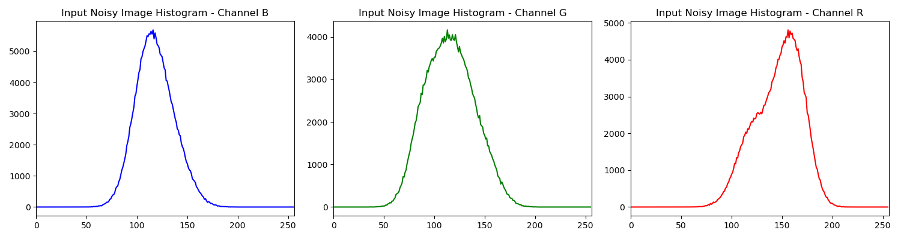
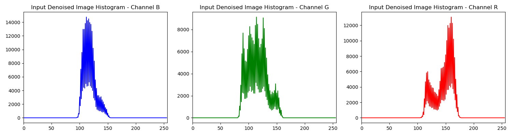
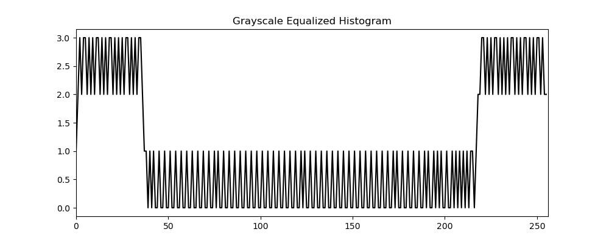
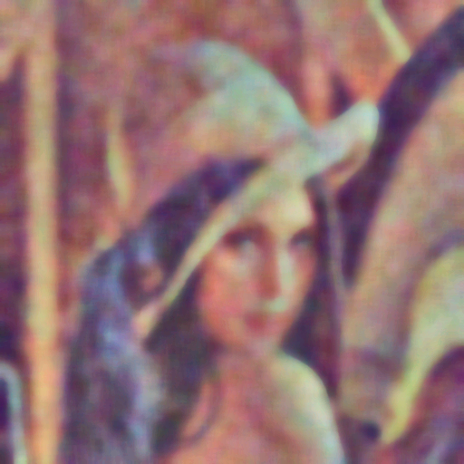
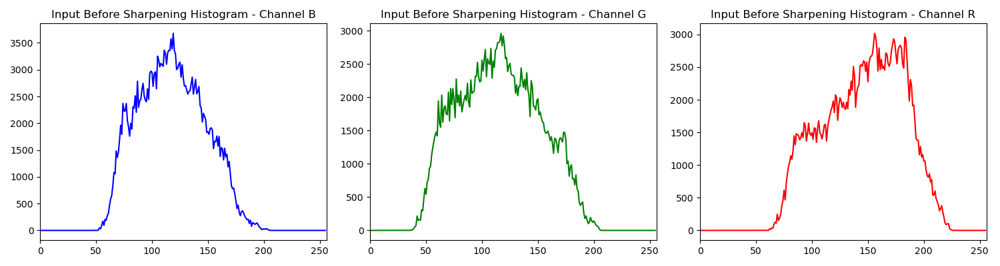
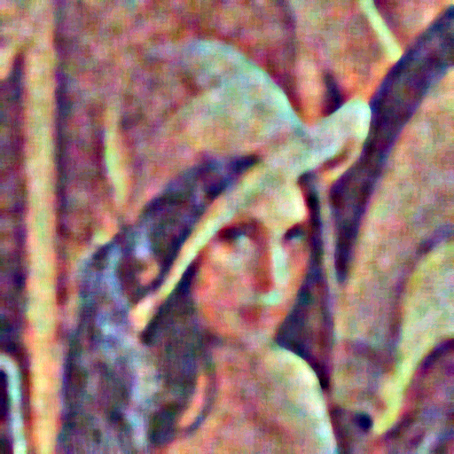

# MP1: Image Restoration

## Identitas pria yang mengerjakan repo ini
- **Nama**: Rahmat Maulana Ansori
- **NRP**: 5024241011
- **Tugas**: Merestorasi foto Lena yang rusak oleh salt&pepper, low contrast, blur, dan gaussian noise menggunakan teknik pengolahan citra manual 

---

## Rumusan Masalah

Citra di folder input mengalami kerusakan berupa:
- **Low Contrast**          : rentang intensitas sempit
- **Gaussian Noise**        : noise acak berdistribusi normal
- **Salt-and-Pepper Noise** : piksel hitam dan putih acak
- **Blur**                  : detail citra menjadi kabur

**Tujuan**: Merestorasi citra ke kualitas yang mendekati original menggunakan teknik-teknik pengolahan citra.

---

## Metode Penyelesaian

### Diagram Alur (pipeline)
```
Input (Noisy & Blurred)
         ↓
[Step 1] DENOISING
  - Median Filter 
  - Gaussian Filter
  - Combine 50:50
         ↓
[Step 2] HISTOGRAM EQUALIZATION
  - Histogram Equalization (PMF -> CDF -> LUT )
  - CLAHE 
         ↓
[Step 3] SHARPENING
  - Unsharp Masking
  - Laplacian Manual (masking tepinya)
         ↓
Output (Restored)
```

### Penjelasan Setiap Teknik

#### 1. **Denoising** (File: `denoising.py`)

**Tujuan**: Menghilangkan salt-and-pepper noise dan Gaussian noise

**Teknik yang digunakan**:
- **Median Filter**: Mengganti nilai pixel dengan nilai median dari tetangganya
  - Untuk menghilangkan salt-and-pepper noise
  - Kernel size: 15x15
  - Kernel formula: Ambil median dari 225 pixel dalam window 15x15
  
- **Gaussian Filtetr**: 
  - Menghilangkan gaussian noise
  - Membuat kernel gaussian dengan formula np.exp(-0.5 * (np.square(x) + np.square(y)) / np.square(sigmaSigmaBoy))
  - Kernel size & param : 25 & 6.0

**Alasan Pemilihan**:
- Median filter untuk menghilangkan salt-and-pepper noise
- Gaussian filter untuk menghilangkan Gaussian noise 
- Kombinasi kedua filter memberikan hasil yang lebih baik 

#### Perbandingan Visual Sebelum & Sesudah Denoising

**Before**:




**After**:





#### 2. **Histogram Equalization** (File: `equalization.py`)

**Tujuan**: Memperbaiki masalah low contrast

**Teknik yang digunakan**:
- **Histogram Equalization**
  - Mendistribusikan intensitas secara merata dalam rentang 0-255 
  - PMF -> CDF -> LUT
- **CLAHE (Contrast Limited Adaptive Histogram Equalization)**
  - Membagi citra ke dalam tile (8x8)
  - Melakukan histogram equalization pada setiap tile secara terpisah
  - Membatasi amplifikasi kontrast dengan clip_limit untuk menghindari over-amplification
  
**Alasan Pemilihan**:
- CLAHE lebih baik dari global histogram equalization karena menghindari over-amplification
- Menghindari area washing out (rata putih)
- Mengurangi noise amplification

**Algorithm**:
```
1. Untuk setiap tile:
   a. Hitung histogram
   b. Clip histogram dengan clip_limit
   c. Hitung CDF (Cumulative Distribution Function)
   d. Normalisasi CDF ke range 0-255
   e. Map pixel values menggunakan CDF yang dinormalisasi
```

#### Perbandingan Visual Sebelum & Sesudah Equalization

**Before**:


**After**:






#### 3. **Sharpening** (File: `sharpening.py`)

**Tujuan**: Mempertajam gambar yang kabur dari denoising

**Teknik yang digunakan**:
- **Unsharp Masking dengan mask Laplacian**
  - Citra asli masih buram 
  - Masking tepi (Asli - Blur) menggunakan kernel Laplacian
  - Hasil akhir (Asli + Masking)

---


#### Perbandingan Visual Sebelum & Sesudah Denoising

**Before**:


**After**:




---

## File-file Proyek

```
MP1_Image_Restoration/
├── README.md                             # File ini
├── restoration.py                        # Main pipeline (gabungan ketiga teknik)
├── denoising.py                          # Standalone denoising module
├── equalization.py                       # Standalone histogram equalization module
├── sharpening.py                         # Standalone sharpening module
├── input/
│   ├── test_image_lena_noisy.png         # Input citra rusak
│   └── test_image_lena_ori.png           # Reference original
└── output/
    ├── 00_histogram_input.png                   # Histogram gambar input
    ├── 01_denoised.png                         # Denoised image
    ├── 01_histogram_denoised.png               # Histogram denoised image
    ├── 02_equalized.png                        # Equalized image
    ├── 02_histogram_equalized.png              # Histogram equalized image
    ├── 03_sharpened.png                        # Sharpened image
    └── 03_histogram_sharpened.png              # Histogram sharpened image
```

---

## Cara Menjalankan Program

### Prerequisite
```bash
pip install opencv-python numpy matplotlib
```

### Run Main Pipeline
```bash
python restoration.py
```

Output:
- Menampilkan progress information di console
- Generate visualization dengan histogram comparison
- Save hasil ke `output/` dengan histogram di setiap tahap
- Histogram ditampilkan untuk input, denoised, equalized, dan sharpened images
- File histogram tersimpan dengan format PNG di folder output

### Run Individual Modules
```bash
# Run hanya denoising
python denoising.py
```
Output:
- Tampilkan histogram untuk input noisy image
- Tampilkan histogram untuk denoised median filter
- Tampilkan histogram untuk denoised gaussian filter
- Tampilkan histogram untuk combined denoised image
- Simpan semua histogram dan image hasil ke folder output

```bash
python equalization.py
```
Output:
- Tampilkan histogram untuk input denoised image
- Tampilkan histogram untuk grayscale equalized
- Tampilkan histogram untuk grayscale CLAHE
- Tampilkan histogram untuk color equalized
- Tampilkan histogram untuk color CLAHE LAB
- Simpan semua histogram dan image hasil ke folder output

```bash
python sharpening.py
```
Output:
- Tampilkan histogram untuk image sebelum sharpening
- Tampilkan histogram untuk edge detection sharpened
- Tampilkan histogram untuk unsharp masking sharpened
- Simpan semua histogram dan image hasil ke folder output
```

---

## Galeri Histogram Lengkap

### Denoising Module (denoising.py)

**Histogram Input Noisy**:


**Histogram Denoised Median Filter**:


**Histogram Denoised Gaussian Filter**:


**Histogram Denoised Combined**:


---

### Equalization Module (equalization.py)

**Histogram Grayscale Equalized**:


**Histogram Grayscale CLAHE**:


**Histogram Color Equalized**:


**Histogram Color CLAHE LAB**:


---

### Sharpening Module (sharpening.py)

**Histogram Before Sharpening**:


**Histogram Sharpened Edge Detection**:


**Histogram Sharpened Unsharp Masking**:


---

## Hasil dan Analisis
1. Analisis Proses Penghilangan Noise 
Untuk menghilangkan noise salt&pepper dan gaussian noise, saya menggunakan median & gaussian filter yang menggabungkannya dengan bobot 50:50. Dan untuk mencari hasil yang terbaik saya membuat variasi dari kernel size median filter dan sigma gaussian filter yang kemudian didapat nilai idealnya yaitu 15 dan 10.0. Nilai tersebut saya ambil karena kalau nilainya kebesaran akan terlalu blur dan menghilangkan fitur detailnya, dan kalau nilainya terlalu rendah ada beberapa noise yang tidak terfilter. Tapi sepertinya tahap ini yang menjadikan hasilnya tidak sebagus seperti yang diharapkan.

2. Analisis Proses Equalization
Sebelumnya saya menggunakan histogram equalization saja dan seperti teori di ppt katakan, ada daerah washout atau keterangan. Jadi saya coba menggunakan CLAHE dari cv2 dan hasilnya jauh lebih baik. Kemudian saya coba bikin fungsi CLAHE manual incase dosen saya tidak membolehkannya. Dan didapat gambar hasilnya terlihat terpotong-potong karena tiap grid tidak saya jembatani. Mengatasi hal itu saya menggunakan interpolasi bilinear untuk nilai luts nya. Dan didapat hasilnya sama persis dengan CLAHE dari cv2 asli (geloo gw jago bet). Dan saya sebelumnya menerapkan clahe di sumbu Lightness dari LAB, dan di kode gabungan (restoration.py) saya coba menerapkannya di ketiga sumbu L, A dan B. Dan hasilnya warnanya sangat mendekati dengan gambar yang diharapkan.

3. Analisis Proses Sharpening
Saya mencoba untuk menggunakan dua metode yaitu pakai edge detection dari Laplacian dan unsharp masking. Karena hasil dari Laplacian kelihatannya rusak karena beberapa gaussian noise masih ada, dan mengurangi noisenya tanpa meniadakan fitur juga sulit jadi saya menyerah akan metode ini. Untungnya metode unsharp masking sangat mudah yaitu blur gaussian seperti di denoising dan mencari mask nya dari image-blur lalu hasilnya berupa image + k * mask. Dan hasilnya sangat bagus jadi saya gaskan aja.

4. Analisis Keseluruhan
Hasilnya cukup mendekati dari segi saturasi dan warna yang membuktikan proses Equalization sukses. Namun fitur dan detail wajah dan bulu yang membutuhkan detail besar menjadi hilang karena proses denoising. Proses sharpening juga cukup bagus karena efek blur menghilang. 


**Status**: **COMPLETED**
**Last Updated**: 26 April 2026


