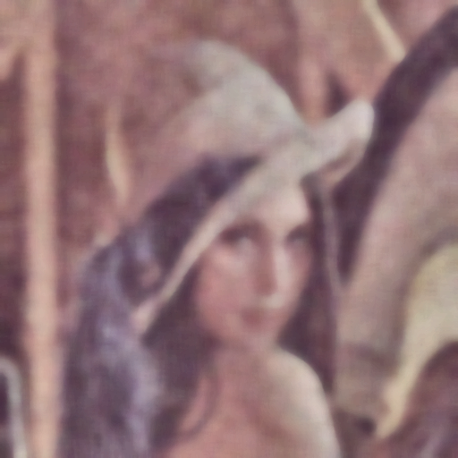

# MP1: Image Restoration

## Identitas pria yang mengerjakan repo ini
- **Nama**: Rahmat Maulana Ansori
- **NRP**: 5024241011
- **Tugas**: Merestorasi foto Lena yang rusak oleh salt&pepper, low contrast, blur, dan gaussian noise menggunakan teknik pengolahan citra manual 

---

## Rumusan Masalah

Citra di folder input mengalami kerusakan berupa:
- **Low Contrast**          : rentang intensitas sempit
- **Gaussian Noise**        : noise acak berdistribusi normal
- **Salt-and-Pepper Noise** : piksel hitam dan putih acak
- **Blur**                  : detail citra menjadi kabur

**Tujuan**: Merestorasi citra ke kualitas yang mendekati original menggunakan teknik-teknik pengolahan citra.

---

## Metode Penyelesaian

### Diagram Alur (pipeline)
```
Input (Noisy & Blurred)
         ↓
[Step 1] DENOISING
  - Median Filter 
  - Gaussian Filter
  - Combine 50:50
         ↓
[Step 2] HISTOGRAM EQUALIZATION
  - Histogram Equalization (PMF -> CDF -> LUT )
  - CLAHE 
         ↓
[Step 3] SHARPENING
  - Unsharp Masking
  - Laplacian Manual (masking tepinya)
         ↓
Output (Restored)
```

### Penjelasan Setiap Teknik

#### 1. **Denoising** (File: `denoising.py`)

**Tujuan**: Menghilangkan salt-and-pepper noise dan Gaussian noise

**Teknik yang digunakan**:
- **Median Filter**: Mengganti nilai pixel dengan nilai median dari tetangganya
  - Untuk menghilangkan salt-and-pepper noise
  - Kernel size: 15x15
  - Kernel formula: Ambil median dari 225 pixel dalam window 15x15
  
- **Gaussian Filtetr**: 
  - Menghilangkan gaussian noise
  - Membuat kernel gaussian dengan formula np.exp(-0.5 * (np.square(x) + np.square(y)) / np.square(sigmaSigmaBoy))
  - Kernel size & param : 25 & 6.0

**Alasan Pemilihan**:
- Median filter untuk menghilangkan salt-and-pepper noise
- Gaussian filter untuk menghilangkan Gaussian noise 
- Kombinasi kedua filter memberikan hasil yang lebih baik 

#### Perbandingan Visual Sebelum & Sesudah Denoising

**Before**:


**After**:


#### 2. **Histogram Equalization** (File: `equalization.py`)

**Tujuan**: Memperbaiki masalah low contrast

**Teknik yang digunakan**:
- **Histogram Equalization**
  - Mendistribusikan intensitas secara merata dalam rentang 0-255 
  - PMF -> CDF -> LUT
- **CLAHE (Contrast Limited Adaptive Histogram Equalization)**
  - Membagi citra ke dalam tile (8x8)
  - Melakukan histogram equalization pada setiap tile secara terpisah
  - Membatasi amplifikasi kontrast dengan clip_limit untuk menghindari over-amplification
  
**Alasan Pemilihan**:
- CLAHE lebih baik dari global histogram equalization karena menghindari over-amplification
- Menghindari area washing out (rata putih)
- Mengurangi noise amplification

**Algorithm**:
```
1. Untuk setiap tile:
   a. Hitung histogram
   b. Clip histogram dengan clip_limit
   c. Hitung CDF (Cumulative Distribution Function)
   d. Normalisasi CDF ke range 0-255
   e. Map pixel values menggunakan CDF yang dinormalisasi
```

#### Perbandingan Visual Sebelum & Sesudah Denoising

**Before**:


**After**:




#### 3. **Sharpening** (File: `sharpening.py`)

**blum coba**

---

## File-file Proyek

```
MP1_Image_Restoration/
├── README.md                             # File ini
├── restoration.py                        # Main pipeline (gabungan ketiga teknik)
├── denoising.py                          # Standalone denoising module
├── equalization.py                       # Standalone histogram equalization module
├── sharpening.py                         # Standalone sharpening module
├── input/
│   ├── test_image_lena_noisy.png         # Input citra rusak
│   └── test_image_lena_ori.png           # Reference original
└── output/
    ├── lena_restored.png                 # Final restored image
    ├── 01_denoising.png                  # Denoising comparison
    ├── 02_histogram_equalization.png     # Histogram comparison
    └── 03_sharpening.png                 # Sharpening comparison
```

---

## Cara Menjalankan Program

### Prerequisite
```bash
pip install opencv-python numpy matplotlib
```

### Run Main Pipeline
```bash
python restoration.py
```

Output:
- Menampilkan progress information di console
- Generate visualization dengan histogram comparison
- Save hasil ke `output/lena_restored.png`

### Run Individual Modules
```bash
# Run hanya denoising
python denoising.py

# Run hanya histogram equalization
python equalization.py

# Run hanya sharpening
python sharpening.py
```

---

## Hasil dan Analisis
**pokoke denoising sukses**

**Status**: on progress
**Last Updated**: 24 April 2026


